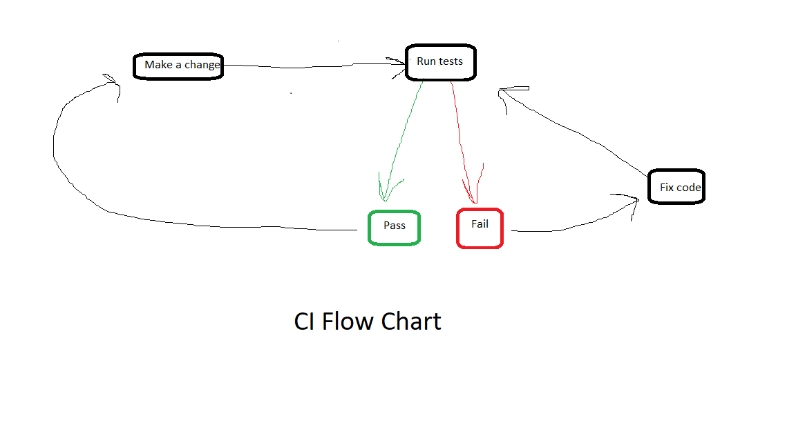

# DevOps, Continuous Integration, Continuous Delivery, and Continuous Deployment

# DevOps - - Jamaal Fisher

### DevOp-LifeCycle:

## Definition of DevOps

DevOps is a collaborative culture with a set of practices, ideas, tools, technologies, and processes that streamline the product development process.
This huge cultural shift lays emphasis on effective communication, integration, and better collaboration among teams for delivering quality products.
Basically, DevOps is a methodology that helps organizations build software - and their production teams - in a way that enables continuous rapid deployment.
In the words of Patrick Debois, the Godfather of DevOps, “it is a movement of people who think it’s time for a change in the IT Industry - time to stop wasting money, time to start delivering great software, and building systems that scale and last”.

## Key Disadvantages of DevOps

- Organizational: Focusing more on delivering working software than on documentation is preferred by both DevOps and its foundational Agile roots, but it may become more difficult for developers and operators to keep track of their advances as well.
- Processes: It will take time for users to adjust to a change in velocity.  Procedurally, the organization will need to be more fault-tolerant at least in the early going. Mistakes must be made and observed to stimulate rapid learning and resolution. This will be uncomfortable to some.
- Technology: While automation can be a good thing to ensure that the pace of operations can keep up with the DevOps continuous feedback cycle, it can have unintended consequences if the automation is not set up properly and monitored.
- Speed and Security: Speed and security don’t necessarily get along with each other very well. Rapid development can lead to severe security shortfalls if there is not a separate plan of action to ensure that speed is not outpacing the security systems designed to protect the products.

### Key Groups:

## Key Groups of DevOps Culture:

- Development
  - Development gives Operations continuous feedback, while Operations gives Development automated provisioning.

- Operations
  - Operations gives QA continuous feedback, while QA gives Operations automated testing.

- Quality Assurance (QA)
  - QA gives Development continuous feedback, while Development gives QA automated build and deploy.

### Key Phases

## Key Phases of DevOps Culture:

- Planning phase: development decides on plans, keeping in mind the application objectives to deliver to the customer
- Coding phase: teams works on the same code, then stores the original code and different versions of the code in a repository, and merge when required in a process called version control.
- Build phase: the code is made executable.
- Test phase: the code is tested for any bugs or errors through automation.
- Deploy phase: ready for deployment, sent to operations.
- Operate phase: deploys for the working environment.
- Monitor phase: the product is continuously monitored.  the feedback received is sent back to the planning phase.
- Integration phase: the core of the DevOps life cycle.  if the code adjustments pass the test, it is sent back through the phases in a process called continuous integration (CI).

# Continuous Integration - Blake Anderson
### CI Flow Chart:

## Continuous Integration

Highly misunderstood. People often think they are doing it when they are not.
Essentially it is the process of continuously merging and testing small, incremental changes to the code base that all developers on a team are working on. 

## Before Continuous Integration

 People worked individually for extended periods of time until a whole feature was done and their code diverged and caused merge conflicts.
 This was problematic
 Some call it “merge hell”

## How to Fix Merge Hell?

In short, continuous integration.
 As soon as some small aspect of the code works, it is merged.
 Everyone is working on the same code base in principle.
 Everyone is merging so often that the code doesn’t diverge.

## Testing

Continuous integration can lead to things being continuously broken
 That’s where testing comes in.
Testing is the safety net.
 Code only merges if tests pass, so you always have a testable build.

## In Summary

 CI is the process of automating the building and testing of an application after each incremental and functional change to the code base.
 These changes only impact the code base if they are functional (meaning they pass the automated tests set in place).
# Continuous Delivery-  Daniel Oszczapinski
### CD - Lifecycle:

## What is Continuous Delivery?

- Continuous Delivery occurs and the end of the Continuous Integration cycle and can be combined into one together.
- Continuous Delivery takes Continuous Integration one step further, after a build and automated unit tests are successful, then it can be deployed in an environment where there is more in-depth testing and move to any other additional stages/environments.
- This also includes continuous feedback from users to implement necessary fixes to ensure the code is always in a deployable state.
- Continuous Delivery has a focus on the release and release strategy
- There also need to be a release manager that checks the code before the depoloyment stage.
- *Important* - Continuous delivery is a partly manual process for deployment. This gives the options on when to deploy the product.

## Why use Continuous Delivery

- Time-to-Value Proportion - which means the team spends less time on debugging and more time on valuable functionality. This means shorter times between user interaction and updates.

- Maximum automation - this means that testing and deployment stages are automated.

- High quality and low risk - The number of bugs or mistakes are reduced significantly because there is every stage goes through Continuous automated verification of deployment.

- Reduced cost - Reduce the cost by revealing bugs as early as possible.

## Pros and Cons of Ci/CD

Pros:
- Speed of deployment
- Faster testing and analysis
- Smaller code changes
- Better and faster fault isolation
- Increased code coverage
- Automatic deploy to production
- Never ship broken code
- Process is repeatable
- Faster mean time to resolution
- Smaller backlog
- Improved customer satisfaction

Cons:
- New skill sets must be learned
- Steep learning curve to implement automation
- Big upfront investment
- Legacy systems rarely support CI/CD
- High degree of discipline and dedication to quality

## Tools that use CI/CD, Major cloud providers:

- GitHub - Version Control tool
- Gitlab - is a suite of tools for managing different aspects of 
- Docker - Container Management tools, that developers use to build, test and collaborate.

CI / Deployment Automation tools:
- Jenkins - One of the best known open source tools for CI/CD
- TeamCity - JetBrains’s build management and continuous integration server
- Bamboo - is a continuous integration server that automates the management of software application releases, thus creating a continuous delivery pipeline
the software development lifecycle.

# Continuous Deployment - James Alouch

## What is Continuous Deployment?

- Continuous deployment (CD, or CDE) is a strategy or methodology for software releases where any new code update or change that makes it through the rigorous automated test process is deployed directly into the live production environment where it will be visible to customers.
 **The goal of a continuous deployment process is simple:**
- 1. To minimize the cycle time that is required to write a piece of code.
- 2. Test it to ensure that it functions correctly and does not break the application,
- 3.  Deploy it to the live environment and collect feedback on it from users.
- Automation is a key driver of productivity for teams that are doing continuous deployment. A robust battery of automated tests must be programmed to verify that
-new code commits are functional before they are automated, and additional tools are required to abort the deployment process and trigger human intervention when the
-tests reveal lower-than-expected quality results or outcomes.
Continuous deployment adds an element of risk to the software release process, as developers are frequently committing unproven code which could potentially
-contain bugs to the live environment. Organizations that implement continuous deployment must therefore develop real-time monitoring capabilities of the live
-environment to rapidly discover and address any technical issues that occur after a new release.

**Continuous Integration vs Continuous Deployment**

- Continuous integration refers to the software engineering practice of merging all of the output from software development teams into a shared mainline several times daily.
- The practice originated in the early 1990's with an over-arching purpose of preventing integration problems in the software development process that would result when development
In the past, a software developer working on an application would obtain a copy of the current code base to build and test a change. As the code base was constantly being updated by other developers,
- this copy of the code base would become increasingly out-of-date over time. Still, the developer would build and test their change, but the final step was always to
integrate the change back into the code base.
- This always created a problem though - sometimes, the code base had changed significantly since the original copy of it was made, which could lead to problems when integrating the developer code back into the main line.
- Sometimes, the newly implemented changes included resources that conflicted with other code in the code base, which meant more integration problems.
- In some cases, developers would spend more time integrating their newly implemented changes back into the main code base than they had implementing the actual changes in the first place.

**Developer teams that practice continuous integration**

1. Avoid integration issues by ensuring that their working copies are merged into the main code bank several times each day. These regular commits reduce the number of conflicting changes, and any discovered conflicts are small and can usually be fixed relatively quickly.
2. In contrast, developer teams that only commit changes once per week or once per month can build up a lot of conflicts between builds, leading to more difficulties when integrating the code.

•	Continuous deployment takes CI a step further and automates the code release process so that each time new commits are merged into the mainline, automated testing is conducted and a pass results in the update being pushed to the production environment.

•	 The key to achieving continuous deployment is to start with a functioning work flow for continuous integration, then streamline and automate the application release process so you can roll out new releases on a regular basis.

**Continuous Deployment vs DevOps**

Continuous deployment and DevOps are not the same thing, but they aren't necessarily mutually exclusive either and software developers can actually achieve some pretty interesting results by leveraging both paradigms.
For starters, it's clear that continuous deployment and DevOps have similar goals.

- DevOps is a set of software development practices with an emphasis in shortening software development cycle times and time-to-value while frequently delivering updates and new features.
  - Continuous deployment strives to deliver frequent updates as well, but it does so through a specific approach to change integration and delivery that minimizes lead times and relies on automation to facilitate frequent testing and software releases.
Ultimately,

## Difference between Continuous deployment and DevOps

- continuous deployment describes a single practice for software development,
- DevOps offers an entire range of processes and best practices that are designed to help dev teams deliver code quickly that is tightly aligned with business strategy and objectives.
  - The DevOps framework includes third-party software recommendations for every stage of the product development process and guidelines for establishing a strong DevOps culture within your organization. These characteristics of DevOps are well beyond the scope of Continuous Deployment.

**What are the Benefits of Continuous Deployment?**
## Why are more software developers moving beyond the continuous integration model and working towards continuous delivery and continuous deployment? 

- The combination of continuous development and DevOps can enable lightning-speed releases, but that's not the only benefit that organizations are seeing from their adoption of CD. 
**Here are just a few benefits of continuous deployment:**
- 1.Maintain Capability for Quick New Releases
The most important feature of continuous deployment is that is enables developer teams to get their new releases into the production environment as quickly as possible. Most software companies can no longer rely on development methodologies that were common when developers released software updates once per year. Some companies are rolling out up to 10 deployments per day with continuous deployment.
- 2.Enable a More Rapid Feedback Loop with Customers
More frequent updates to your application means a shorter feedback loop with the customer. Using state-of-the-art monitoring tools, developer teams can assess the impact of a new change on user behavior or engagement and make adjustments accordingly. The ability to rapidly release changes is an asset when customer behavior indicates the need for a quick pivot or change in strategy.
- 3.Reducing Manual Processes with Automation
Continuous deployment is defined by its use of automation in the application deployment process. In fact, continuous deployment wants developers to automate the entire software development process to the greatest extent possible, especially when it comes to release testing. Automation doesn't just help developers push out new releases faster, they actually spend less time on manual processes and get more work done.

https://www.sumologic.com/glossary/continuous-deployment/

### References:

[Microsoft-CI/CD](https://docs.microsoft.com/en-us/aspnet/aspnet/overview/developing-apps-with-windows-azure/building-real-world-cloud-apps-with-windows-azure/continuous-integration-and-continuous-delivery)

[Youtube-Devop](https://www.youtube.com/watch?v=Xrgk023l4lI)

[Youtube-CI](https://www.youtube.com/watch?v=_zCyLT33moA)

[Youtube-Ci-Second](https://www.youtube.com/watch?v=1er2cjUq1UI&t=73s)

[Youtube-CD](https://www.youtube.com/watch?v=2TTU5BB-k9U)

[IBM-CompleteGuideDevops](https://www.ibm.com/cloud/learn/devops-a-complete-guide)

[Agile-Devops](https://theagileadmin.com/what-is-devops/)

[RedHat-CI/CD](https://www.redhat.com/en/topics/devops/what-is-ci-cd)

[Itporportal-DevopsvsCI/CD](https://www.itproportal.com/features/stop-messing-up-with-cicd-vs-devops-and-learn-the-difference-finally/)

[Altexsoft-CI/CD](https://www.altexsoft.com/blog/business/continuous-delivery-and-integration-rapid-updates-by-automating-quality-assurance/)

[PillarGlobal-AdvantagesofDevOps](https://www.3pillarglobal.com/insights/disadvantages-of-using-devops/)

[CD-Deployment](https://www.sumologic.com/glossary/continuous-deployment/)

[Sumlogic](https://www.sumologic.com/glossary/continuous-deployment/)